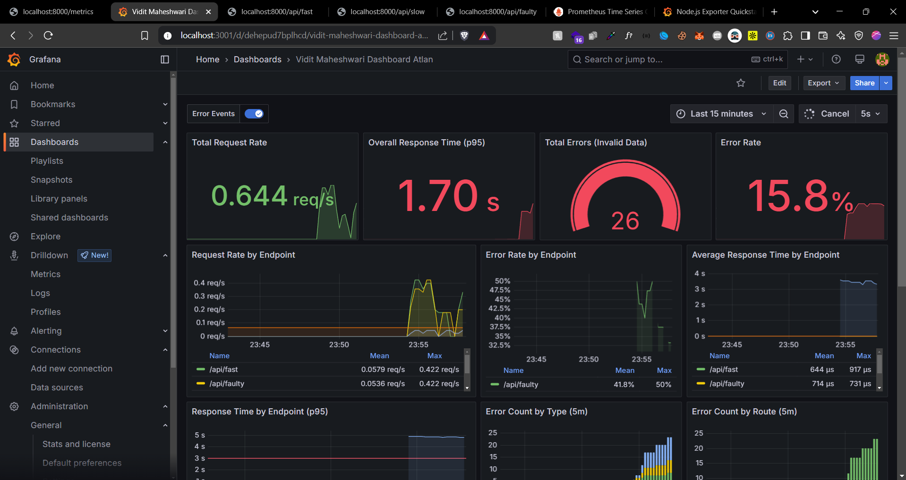
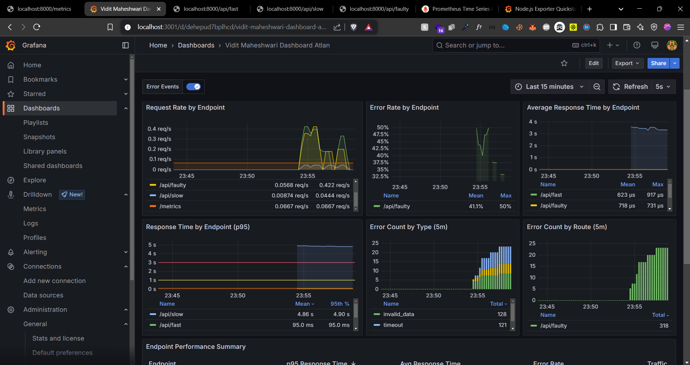
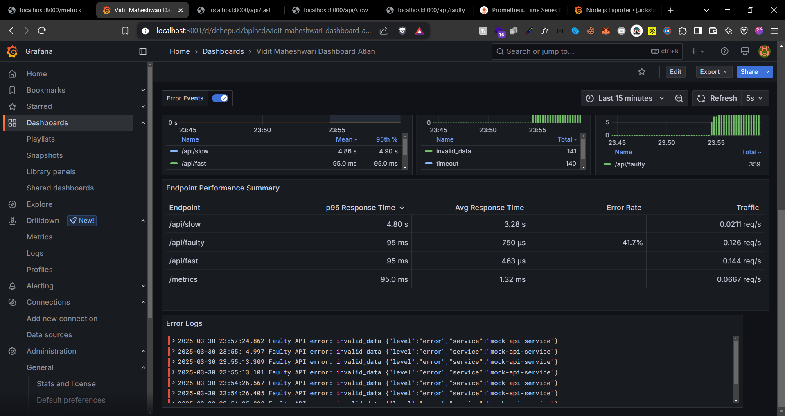
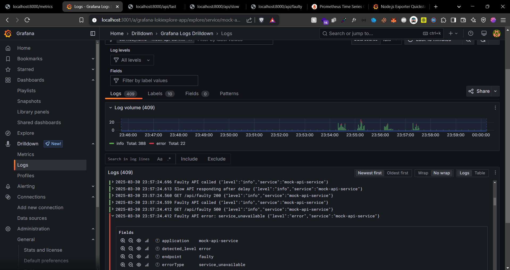
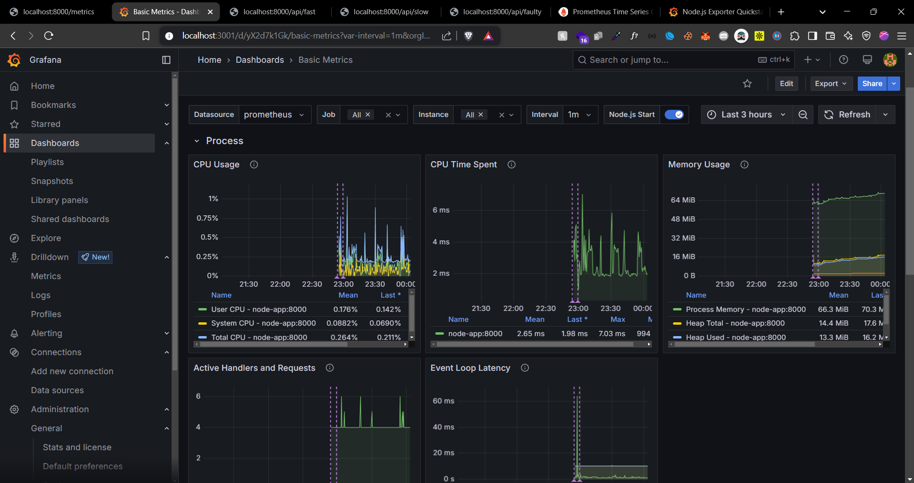

# Observability Challenge 2025

  
  
<em>Real-time Observability Dashboard</em>

## 📋 Table of Contents
- [Overview](#overview)
- [Project Structure](#project-structure)
- [Demo System](#demo-system)
- [Production Architecture](#production-architecture)
- [Features](#features)
- [Screenshots](#screenshots)
- [Demo Video](#demo-video)
- [Setup Guide](#setup-guide)
- [Why This Stack?](#why-this-stack)
- [Contributing](#contributing)
- [License](#license)

## Overview

This project demonstrates a comprehensive observability solution using modern tools and best practices. It includes both a local demo system for learning and testing, as well as a production-ready architecture design.

## Project Structure

.
├── app.js                 # Main application code
├── docker-compose.yaml    # Container orchestration
├── prometheus.yml        # Prometheus configuration
├── dashboard_1.json      # Grafana dashboard configuration
├── dashboard_2.json      # Additional dashboard configuration
├── images/              # Screenshots and diagrams
└── logs/               # Application logs

## Demo System

This repository contains a mock implementation designed to demonstrate observability concepts on a local system. It's perfect for:
- Learning observability best practices
- Testing monitoring configurations
- Understanding metrics collection
- Experimenting with different visualization options

### Demo Features
- Local containerized environment
- Sample endpoints with various behaviors
- Pre-configured dashboards
- Example alerts and notifications

## Production Architecture

  
  
<em>Production-Level System Architecture</em>

Note: The production architecture diagram will be uploaded soon. This will showcase a real-world implementation with:
- High availability setup
- Load balancing
- Multi-region deployment
- Enterprise-grade security
- Scalable infrastructure
- Disaster recovery
- Compliance considerations

## Features

### 🚀 Test Endpoints
- /api/fast: Quick response endpoint
- /api/slow: Simulated slow response (2-5s delay)
- /api/faulty: Endpoint with 40% error rate
- /api/memory-leak: Simulates memory leaks
- /api/cpu-intensive: CPU-intensive operations
- /metrics: Prometheus metrics endpoint
- /health: Health check endpoint

### 📊 Observability Stack
- Custom Prometheus metrics
- Structured logging with Winston
- Log aggregation with Loki
- Beautiful Grafana dashboards

## Screenshots

### Dashboard Overview

### Metrics Visualization

### Log Analysis

### Performance Monitoring

### Error Tracking

## Demo Video
[Watch the Demo Video](https://www.youtube.com/watch?v=EfBiiuH6wnw)

## Setup Guide

### Prerequisites
- Docker
- Docker Compose

### Quick Start

1. Clone the repository:
bash
git clone https://github.com/vidit-maheshwari/Observability-challenge-2025
cd Observability-challenge-2025

2. Start the services:
bash
docker-compose up -d

3. Access the services:
- Application: http://localhost:8000
- Grafana: http://localhost:3001 (username: admin, password: admin)
- Prometheus: http://localhost:9090
- Loki: http://localhost:3100

### Architecture Components

- *Node.js Application*: A mock API service that generates various types of metrics and logs
- *Prometheus*: Collects and stores metrics from the application
- *Grafana*: Visualizes metrics and logs through custom dashboards
- *Loki*: Aggregates and stores application logs

### Monitoring Features

1. *Metrics Collection*:
   - HTTP request duration
   - Request counts
   - Error rates
   - Custom application metrics

2. *Logging*:
   - Structured JSON logging
   - Log levels (info, warn, error)
   - Contextual information
   - Correlation IDs

3. *Visualization*:
   - Real-time metrics
   - Historical data analysis
   - Custom dashboards
   - Alert configurations

## Why This Stack?

This project uses the Grafana Stack (Prometheus + Grafana + Loki), which is widely considered one of the best observability solutions in the market for several reasons:

### 1. Open Source and Community-Driven
- All components are open-source, ensuring transparency and community support
- Large, active community contributing to continuous improvements
- No vendor lock-in, allowing for flexibility and customization
- Free to use, with optional enterprise features

### 2. Prometheus - Industry Standard for Metrics
- *Time Series Database*: Optimized for storing and querying time-series data
- *Powerful Query Language*: PromQL offers advanced querying capabilities
- *Pull-based Architecture*: More reliable than push-based systems
- *Multi-dimensional Data Model*: Labels enable flexible data organization
- *Service Discovery*: Automatic target discovery for dynamic environments
- *High Availability*: Built-in support for federation and HA

### 3. Grafana - Leading Visualization Platform
- *Rich Visualization Options*: 100+ built-in panels and plugins
- *Template Variables*: Dynamic dashboard creation
- *Alert Management*: Integrated alerting with multiple notification channels
- *Dashboard Sharing*: Easy collaboration and sharing capabilities
- *Role-Based Access Control*: Enterprise-grade security
- *Plugin Ecosystem*: Extensive community plugins

### 4. Loki - Modern Log Aggregation
- *Cost-Effective*: Indexes only metadata, not full log content
- *Kubernetes Native*: Built-in support for container environments
- *Prometheus-Compatible*: Uses same labels and query language
- *Horizontal Scalability*: Easy to scale with your needs
- *LogQL*: Powerful query language for log analysis
- *Multi-tenant Support*: Built-in support for multiple organizations

### 5. Integration Benefits
- *Unified Query Language*: LogQL and PromQL provide consistent querying
- *Seamless Integration*: Components work together out of the box
- *Correlation*: Easy correlation between metrics and logs
- *Single Pane of Glass*: Unified interface for all observability needs
- *Resource Efficient*: Optimized for resource usage
- *Cloud Native*: Perfect fit for modern cloud environments

### 6. Competitive Advantages Over Alternatives
- *ELK Stack*: More resource-efficient, better query performance
- *New Relic/Datadog*: No vendor lock-in, more cost-effective
- *Splunk*: Better scalability, more modern architecture
- *CloudWatch*: More flexible, better for multi-cloud environments
- *Dynatrace*: More customizable, better for open-source environments

### 7. Future-Proof
- *Cloud Native*: Built for modern infrastructure
- *Container Ready*: Native support for containers and Kubernetes
- *Microservices Architecture*: Perfect for distributed systems
- *Continuous Evolution*: Regular updates and improvements
- *Community Growth*: Expanding ecosystem of tools and integrations

## License

Author - Vidit Maheshwari
Github - https://github.com/vidit-maheshwari
LinkedIn - https://www.linkedin.com/in/vidit-maheshwari

---

  
Made with ❤ for the Observability Challenge 2025

